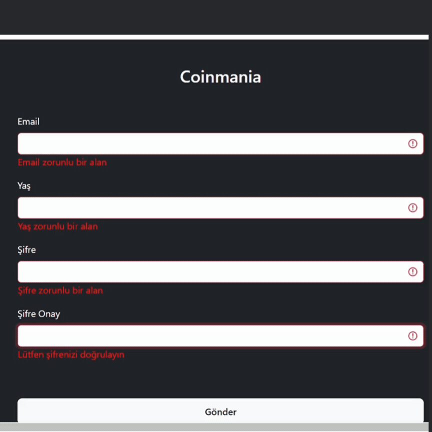

## Coinmania

Coinmania est une application React où les utilisateurs peuvent remplir un formulaire simple pour soumettre des données. La validation du formulaire est effectuée à l'aide de Formik et Yup. Bootstrap est utilisé pour le style des composants.

## Technologies Utilisées

- React
- Formik
- Yup
- Bootstrap

### Fonctionnalités du Formulaire

Le formulaire recueille le nom et l'adresse e-mail des utilisateurs et soumet les données. Les règles de validation sont appliquées à l'aide de Formik et Yup.

### Utilisation de Formik et Yup

#### Formik

Formik est une bibliothèque qui simplifie la gestion des formulaires et facilite la validation. Il est utilisé dans ce projet pour gérer l'état du formulaire et traiter la soumission.

#### Yup

Yup est une bibliothèque de validation de schéma d'objet JavaScript. Il est utilisé dans ce projet pour valider les champs du formulaire.

### GIF

